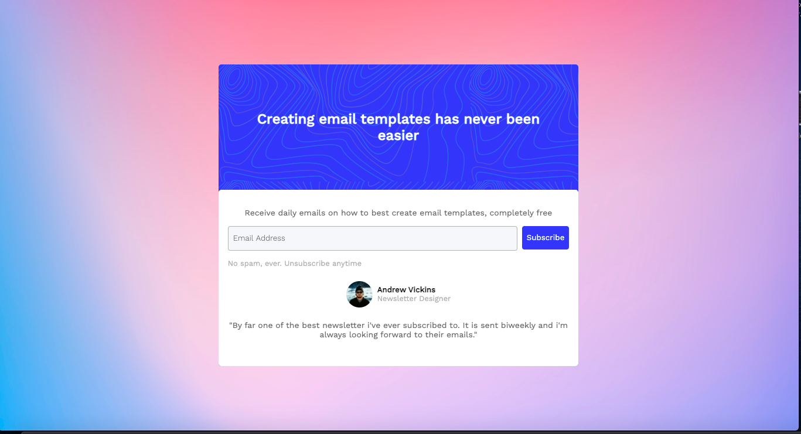

# Newsletter-Popup-Challenge

> This project solves a [challenge](https://www.codewell.cc/challenges/60a8db35203a0e6180bb5035) from Codewell. It consists in creating
  a responsive newsletter popup template.
  The results can be found in the [screenshots folder](https://github.com/evandrmb/Newsletter-Popup-Challenge/tree/master/Screenshots)

## 📫 Contributing to Newsletter-Popup-Challenge
If you want to contribute with your solution for the challenge do the following:
1. Fork the repo
2. Create a branch: `git checkout -b <branch_name>`.
3. Create a folder with your name and solution
4. Do your changes and commit them: `git commit -m '<mensage>'`
4. Push it: `git push origin Newsletter-Popup-Challenge / <local>`
5. File a pull request.

## 📝 License

This project is under license. See [LICENSE](LICENSE.md) for more details.

This repository README follows this [template](https://github.com/iuricode/README-template/blob/main/README-repository/iuricode.md) from https://github.com/iuricode/readme-template
